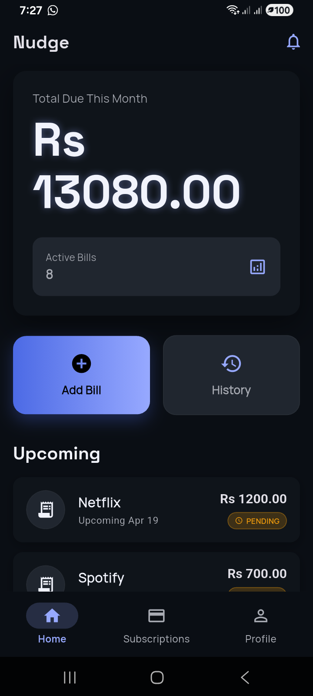
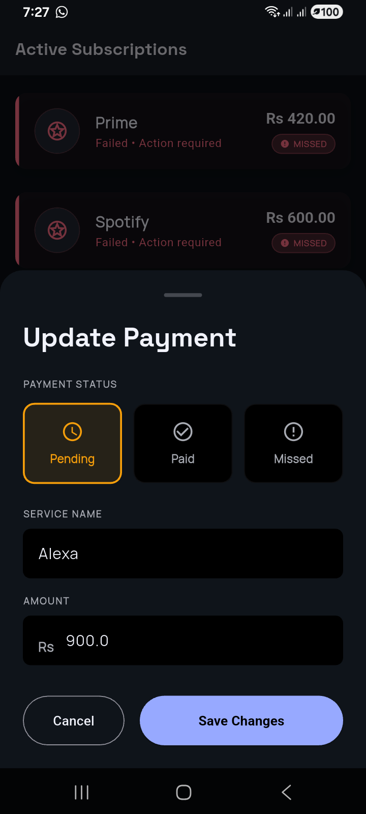
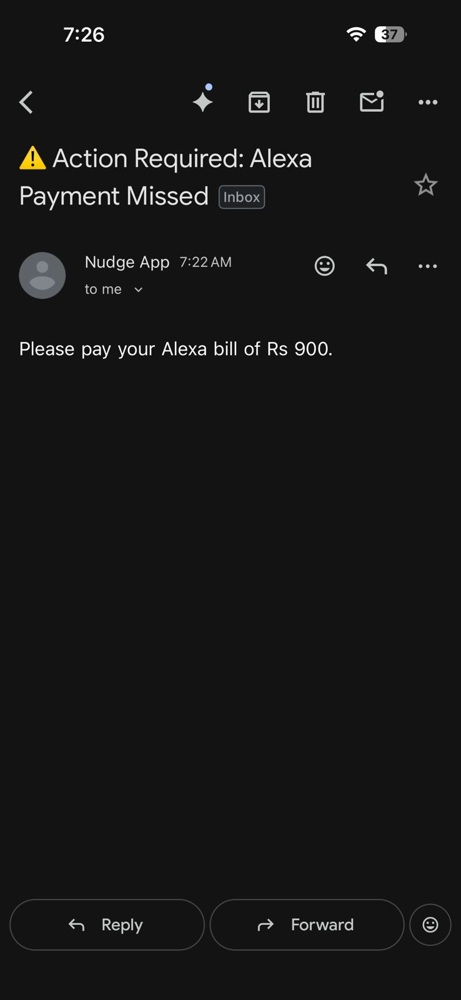

# Nudge | Smart Payment Reminder

> A real-time, event-driven financial dashboard that ensures you never miss a subscription or utility bill again. Built with Flutter and Supabase.

## The Problem

Young professionals and students juggle multiple recurring expenses—ranging from utility bills to digital subscriptions. They frequently incur late fees or service interruptions not due to a lack of funds, but simply due to cognitive overload and forgetfulness. Current tracking methods (spreadsheets or easily dismissed push notifications) fail to provide the right context at the right time.

## The Solution

**Nudge** is a centralized, real-time dashboard that tracks recurring liabilities. Instead of relying on passive push notifications, Nudge uses an event-driven architecture to dispatch high-priority, automated emails when a bill passes its due date, creating an un-ignorable paper trail.

-----

## Core Features

  * **⚡ Real-Time Dashboard:** Powered by Supabase WebSockets, the UI instantly recalculates total dues and shifts active bills as statuses change.
  * **📧 Automated Webhook Reminders:** Edge Functions automatically detect when a payment is marked as "Missed" and dispatch formatted HTML email reminders via the Resend API.
  * **💤 Smart Snoozing:** Quickly defer upcoming bills by 24 hours or 7 days with a single tap.
  * **🔒 Row Level Security (RLS):** Fully secured PostgreSQL database ensuring users can only read/write their own financial data.

-----

## 📸 Design & Interface

| The Dashboard | The Action Sheet | The Automated Nudge |
| :---: | :---: | :---: |
|  |  |  |
| *Live calculation of pending dues and upcoming bills.* | *Instantly update status or modify bill amounts.* | *Serverless email delivered instantly upon missed payment.* |

-----

## Technical Architecture

**Frontend Stack:**

  * **Framework:** Flutter (Dart)
  * **State Management:** Riverpod (`StreamProvider` for real-time reactivity)
  * **UI/UX:** Material Design 3 with custom theming

**Backend Stack (Supabase):**

  * **Database:** PostgreSQL with `REPLICA IDENTITY FULL` enabled for deep row-level broadcasting.
  * **Realtime:** Supabase Realtime (WebSockets)
  * **Serverless Functions:** Deno Edge Functions
  * **Trigger Mechanism:** PostgreSQL Database Webhooks via `pg_net`
  * **Email Provider:** Resend API

-----

## Running Locally

Because this project relies on secure Webhooks and Edge Functions, it is designed to run using the Supabase Local CLI.

### Prerequisites

  * Flutter SDK (`>= 3.0.0`)
  * Docker Desktop (running)
  * Supabase CLI
  * A free [Resend](https://resend.com) API Key

### 1\. Database Setup

Clone the repository and spin up the local Supabase stack:

```bash
git clone https://github.com/yourusername/nudge.git
cd nudge

# Start the local database and studio
supabase start

# Apply all tables, triggers, and Row Level Security policies
supabase db reset
```

### 2\. Environment Variables

Create a `.env.local` file inside the `supabase/` directory:

```env
RESEND_API_KEY=your_resend_api_key_here
```

Create a `.env` file inside the `frontend/` directory:

```env
SUPABASE_URL=http://127.0.0.1:54321
SUPABASE_ANON_KEY=your_local_anon_key_here
```

### 3\. Start the Edge Functions

In a new terminal window, boot up the Deno runtime to listen for database webhooks:

```bash
supabase functions serve --env-file supabase/.env.local
```

### 4\. Run the App

```bash
cd frontend
flutter pub get
flutter run
```

-----

## Testing the Webhook

1.  Launch the app and create a new account.
2.  Add a new bill (e.g., "Netflix").
3.  Tap the bill on the dashboard and change the status to **"Missed"**.
4.  Check your Edge Function terminal for the `200 OK` response.
5.  Check your email inbox for the automated reminder\!

-----